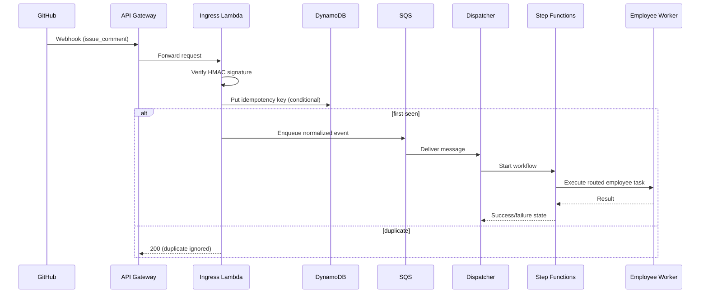

# ADR 002: Production-Grade PR Comment Automation on AWS

Date: 2026-02-25  
Status: Proposed  
Owners: Platform Engineering / AI Orchestration  
Related: #135

## Decision (Executive Summary)
Adopt an **event-driven AWS architecture** for PR-comment automation with:

1. **Stable public webhook ingress** via API Gateway (HTTP API) + AWS WAF
2. **Durable event ingestion** via SQS (primary queue + DLQ)
3. **Idempotent processing** using a DynamoDB idempotency store keyed by GitHub delivery IDs + deterministic dedupe keys
4. **Worker orchestration** using a dispatcher Lambda + Step Functions for employee routing and retry-safe state transitions
5. **Observability-by-default** using CloudWatch metrics/logs/alarms + SLO dashboards + PagerDuty/Opsgenie integration

This replaces fragile local tunnel ingress and best-effort in-memory processing with production-grade durability, replay safety, and operational visibility.

---

## Context & Problem Statement
Current PR-comment automation exhibits fragility in three categories:

1. **Ingress instability (tunnel fragility)**
   - Local/tunnel public endpoints change or drop unexpectedly
   - GitHub webhook deliveries fail during tunnel restarts/network churn
   - No robust failover endpoint or regional redundancy

2. **Delivery/processing reliability gaps**
   - Webhook events can be lost when receiver is unavailable
   - Retries are not uniformly durable or observable
   - Failures are not consistently recoverable from a persistent backlog

3. **Deduplication/replay edge cases**
   - GitHub retries can trigger duplicate execution
   - Manual redeliveries can cause repeated employee dispatch
   - Weak or absent idempotency persistence leads to double-processing risk

These issues are acceptable in dev but not for production automation with SLA/SLO expectations.

---

## Goals / Non-Goals

### Goals
- Reliable webhook intake with stable public endpoint
- At-least-once delivery with exactly-once *effects* via idempotency
- Safe retries with DLQ and replay tooling
- Explicit worker orchestration for employee routing
- Actionable observability and paging
- Security controls aligned to least privilege and auditability
- Low-risk phased migration from current setup

### Non-Goals
- Full multi-cloud portability in v1
- Replacing all internal automation logic at once
- Real-time (<1s) hard-latency guarantees

---

## Target-State Architecture (AWS)

```mermaid
flowchart LR
  GH[GitHub Webhooks] --> APIGW[API Gateway HTTP API]
  APIGW --> WAF[AWS WAF]
  WAF --> ING[Ingress Lambda\n(signature verify + normalize)]
  ING --> IDEMP[(DynamoDB Idempotency Table)]
  ING --> Q[SQS Primary Queue]
  Q --> DISPATCH[Dispatcher Lambda]
  DISPATCH --> SFN[Step Functions\nEmployee Orchestration]
  SFN --> WORKER1[Employee Worker A]
  SFN --> WORKER2[Employee Worker B]
  SFN --> WORKER3[Employee Worker N]
  DISPATCH --> DDB[(DynamoDB Job/State Store)]
  Q --> DLQ[SQS DLQ]
  DLQ --> REPLAY[Replay Tool / Operator Runbook]
  APIGW -. logs .-> CW[CloudWatch + Dashboards + Alarms]
  ING -. traces/metrics .-> CW
  DISPATCH -. traces/metrics .-> CW
  SFN -. execution metrics .-> CW
```

### Core Components
- **API Gateway (HTTP API)**: stable public endpoint for GitHub webhooks; supports throttling and auth integration patterns.
- **AWS WAF**: baseline request filtering and abuse protection.
- **Ingress Lambda**:
  - verifies GitHub `X-Hub-Signature-256`
  - validates required headers (`X-GitHub-Event`, `X-GitHub-Delivery`)
  - normalizes payload envelope
  - writes idempotency marker and enqueues message
- **SQS Primary Queue**: durable buffer decoupling ingress from processing.
- **Dispatcher Lambda**: consumes queue, performs routing to employee orchestration.
- **Step Functions**: stateful orchestration for employee assignment/workflow transitions.
- **DynamoDB**:
  - idempotency table (delivery IDs + semantic keys)
  - workflow/job state table
- **SQS DLQ**: terminal capture for poison messages after retry policy exhausted.
- **CloudWatch + Pager integration**: end-to-end visibility and incident signaling.

---

## Ingress Pattern Recommendation & Alternatives

### Recommended: API Gateway + Lambda (public, stable endpoint)
**Why:** managed scale, low ops burden, native IAM/WAF/logging integration, straightforward webhook handling.

**Pros**
- High availability managed by AWS
- Easy horizontal scaling
- Native request logging/metrics
- Clean integration with Lambda and auth controls

**Cons**
- Per-request and Lambda cost at high sustained volume
- Cold starts (mitigated with provisioned concurrency if needed)

### Alternative A: ALB + ECS/Fargate webhook receiver
- Better for long-lived connection patterns or heavy custom runtime needs
- Higher operational overhead and patch surface

### Alternative B: CloudFront + Lambda Function URL
- Can work for simple endpoints
- Weaker default governance/observability posture than API Gateway-centric setup

### Alternative C: Self-managed ingress (EC2/Nginx)
- Maximum control
- Not recommended: highest ops toil, patching burden, and incident risk

---

## Event Ingestion, Queueing, Idempotency, Retry, DLQ

### Message Envelope
Store a normalized envelope in SQS:
- `delivery_id` (GitHub delivery UUID)
- `event_type` (e.g., `issue_comment`)
- `repo`, `pr_number`, `comment_id`, `action`
- `received_at`
- `payload_ref` (inline for small payloads; S3 pointer for large payloads if needed)

### Idempotency Strategy
Use two-level idempotency in DynamoDB:

1. **Transport-level key**: `delivery_id`
   - prevents duplicate processing due to GitHub redelivery/retry
2. **Semantic-level key**: deterministic hash of critical event dimensions
   - example: `sha256(repo + event_type + pr_number + comment_id + action)`
   - prevents duplicate side effects when delivery IDs differ for equivalent user action patterns

Set TTL (e.g., 7–30 days) based on replay horizon.

### Retry Policy
- SQS + Lambda event source mapping with bounded retries and visibility timeout tuning
- Exponential backoff in orchestration steps for transient downstream errors
- Circuit-breaker behavior for repeated provider failures

### Dead Letter Strategy
- Route failed messages to DLQ after max receive count
- Provide operator runbook + replay script:
  - inspect root cause
  - patch config/code if needed
  - replay safely through same idempotency gates

---

## Worker Orchestration Model for Employee Routing

### Routing Logic
Dispatcher determines target employee/workflow based on:
- repo and branch policies
- comment command intent (e.g., architecture, docs, backend, security)
- issue/PR metadata (labels, ownership)

### Recommended Orchestration
Use Step Functions Standard workflows:
- deterministic state transitions
- retries/timeouts per step
- audit-friendly execution history
- compensation path for partial failures

### State Model (simplified)
1. `Received`
2. `Validated`
3. `Dispatched`
4. `WorkerRunning`
5. `WorkerSucceeded` or `WorkerFailed`
6. `Notified` (comment/update posted)

Persist state transitions in DynamoDB for searchable audit trails and operations views.

---

## Observability & Alerting

### SLOs (initial)
- **Webhook acceptance availability**: 99.9% monthly
- **P95 ingestion-to-dispatch latency**: < 60s
- **Successful workflow completion rate**: > 98% (excluding invalid requests)

### Key Metrics
- API Gateway 2xx/4xx/5xx rates
- Signature validation failures
- SQS depth, age of oldest message, DLQ inflow
- Lambda errors, throttles, duration, concurrency
- Step Functions execution failures/timeouts
- Idempotency hit rate (transport + semantic)

### Dashboards & Paging
- CloudWatch dashboard per env (dev/stage/prod)
- Pager rules:
  - high 5xx sustained > 5 min
  - DLQ non-zero growth > threshold
  - queue age > SLA threshold
  - workflow failure rate spike

---

## Security Model

### Authn/Authz
- Verify GitHub webhook signatures with secret from AWS Secrets Manager
- Restrict endpoint to expected methods/paths
- IAM least-privilege roles per Lambda/StepFunctions component

### Secrets Management
- Secrets Manager for webhook secret and API tokens
- Rotation policy + access via IAM role, no static creds in code

### Least Privilege
- Separate roles for ingress, dispatcher, workers
- Fine-grained permissions (queue/table/function specific ARNs)

### Auditability
- CloudTrail for control-plane actions
- Immutable logs (CloudWatch retention + export policy)
- Traceable execution IDs linking ingress event -> orchestration -> outbound actions

---

## Rollout & Migration Plan (Low Risk)

### Phase 0: Preparation
- Define schemas, idempotency keys, SLIs/SLOs
- Build infra via IaC (Terraform/CDK)

### Phase 1: Shadow Ingestion
- Configure GitHub webhook to hit new AWS ingress in parallel (or mirrored replay)
- Do validation + queue write + dry-run dispatch (no side effects)
- Compare outcomes with current system

### Phase 2: Controlled Cutover
- Route a subset of events (or repos/actions) to AWS path for active processing
- Monitor SLOs, DLQ, duplicate prevention effectiveness

### Phase 3: Full Cutover
- Flip GitHub webhook primary endpoint to AWS
- Keep legacy path as fallback for defined window

### Phase 4: Decommission Legacy Tunnel Path
- Remove tunnel dependency from production workflow
- Finalize runbooks and on-call handoff

Rollback plan: preserve ability to switch webhook endpoint back to legacy path during cutover window; maintain idempotency keys across rollback boundaries.

---

## Cost / Complexity Tradeoffs

### MVP (Recommended first production milestone)
- API Gateway + single ingress Lambda
- SQS + DLQ
- Dispatcher Lambda
- DynamoDB idempotency table
- Basic CloudWatch dashboard + 3 critical alarms

**Why MVP first:** delivers immediate reliability gains with minimal architecture complexity.

### Scale-Up Path
- Step Functions for richer orchestration
- Multi-account environment isolation
- Provisioned concurrency for strict latency
- Enhanced analytics pipeline (Athena/OpenSearch)

### Cost Notes
- Primary cost drivers: API Gateway requests, Lambda duration, SQS requests, Step Functions transitions
- Expected to be low-to-moderate at current PR-comment volume; optimize after baseline telemetry

---

## Explicit Recommendation & Rationale

**Recommendation:** Implement the MVP on AWS now using **API Gateway + Lambda ingress, SQS(+DLQ), DynamoDB idempotency**, then layer **Step Functions orchestration** as the next increment.

**Rationale:**
- Solves current highest-risk failure modes (tunnel fragility + non-durable processing) immediately
- Establishes replay-safe processing through durable queues and idempotency
- Keeps operational complexity proportional to current scale
- Provides a clear growth path to richer orchestration without redesigning ingress/queue foundations

---

## Open Questions
- Required retention duration for idempotency and audit data?
- Expected peak webhook burst rates for concurrency sizing?
- Preferred paging target (PagerDuty vs Opsgenie) and escalation policy?
- Whether to enforce IP allow-listing in addition to signature verification?

---

## Appendix: Sequence (Happy Path)


